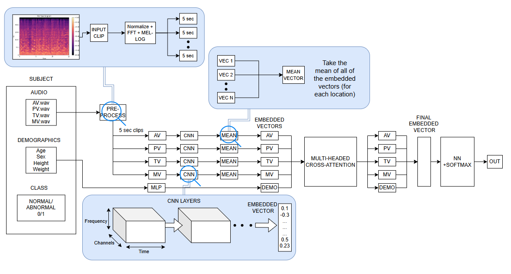
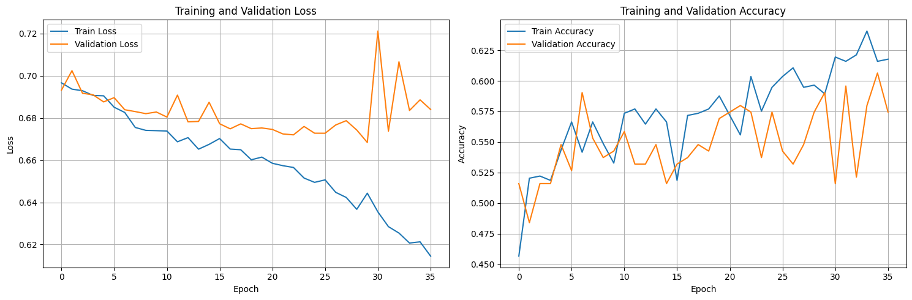
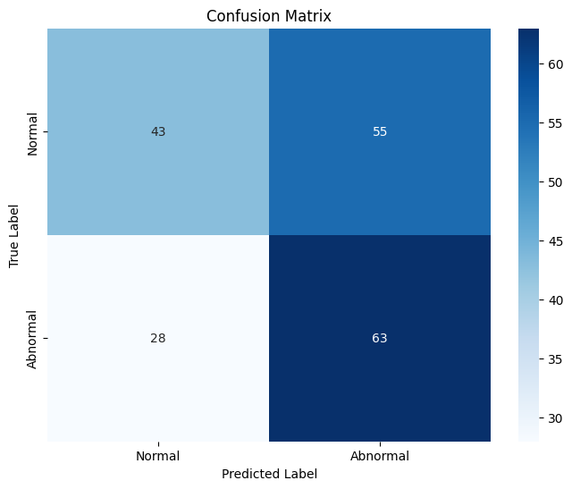

# 00460217 - CardioVoice: Detecting Cardiovascular Risks from Heart Sounds  

This project aims to develop an automated, non-invasive heart murmur detection system using pediatric phonocardiogram (PCG) recordings and demographic data. The model combines CNN-based spectrogram analysis with multi-head attention and demographic features to predict clinical outcomes, even in noisy, real-world environments.

---

## Table of Contents  
1. [Overview](#1-overview)  
2. [How To Run](#2-how-to-run)  
3. [Datasets](#3-datasets)  
4. [Challenges and Solutions](#4-challenges-and-solutions)  
5. [Model Architecture](#5-model-architecture)  
   - [5.1 CNN for Spectrograms](#51-cnn-for-spectrograms)  
6. [Training Approach](#6-training-approach)  
7. [Naive Approach](#7-naive-approach)  
8. [Better Approach](#8-better-approach)  
9. [Training Details](#9-training-details)  
10. [Preliminary Results](#10-preliminary-results)  
11. [Conclusions](#11-conclusions)  

---

## 1. Overview  
CardioVoice is a deep learning system for detecting heart murmurs and predicting clinical outcomes from pediatric PCG recordings. Recordings are taken from multiple auscultation locations (AV, PV, TV, MV) and combined with patient demographics.  

**Motivation:**  
- Congenital and acquired heart disease is a significant health issue.  
- Early detection improves outcomes and reduces costs.  
- Many regions lack cardiology expertise.  
- Automated analysis enables point-of-care diagnosis.  

---

## 2. How To Run  

### Files Explanation  
**Code folder:**  
- **CardioVoice.ipynb** – Complete notebook version of the project, recommended for Google Colab.  

**Python scripts:**  
1. `data_loading_and_preprocessing.py` – Data reading, filtering, segmentation, and feature extraction.  
2. `model.py` – Contains CNN, MLP, and Attention modules.  
3. `training_funcs.py` – Functions for loss calculation, evaluation, and metrics.  
4. `training_pipeline.py` – Full training and validation loop.  
5. `model_visualization_toolkit.py` – Plots for loss curves, accuracy, and confusion matrix.  
6. `usage.py` – Example of running inference on new data.  

**Additional Files:**  
- **Dataset.md** – Dataset download links and metadata.  

### Steps to Run  
1. Upload the dataset file into the notebook.  
2. (Optional) Mount Google Drive in Google Colab for persistent storage.  
3. Run all notebook cells to preprocess, train, and evaluate the model.  

### Custom Dataset Generation  
You can modify the preprocessing scripts to handle new datasets by changing:  
- File paths in `data_loading_and_preprocessing.py`  
- Metadata mapping for demographics  

---

## 3. Datasets  
**Source:** [PhysioNet George B. Moody Challenge 2022](https://physionet.org/content/circor-heart-sound/1.0.3/)  
- **Size:** 5272 recordings, 1568 subjects, aged 0–21 years.  
- **Recording Locations:** AV, PV, TV, MV.  
- **Labels:** Murmur (Present/Absent/Unknown), Clinical Outcome (Normal/Abnormal).  

**Preprocessing:**  
- Bandpass filter: 25–800 Hz  
- Segmentation: 5-second clips (discard remainders)  
- Features: Log mel-spectrograms (`n_mels=128`, `n_fft=1024`, `hop_length=512`)  
- Demographics: Encoded and normalized (height, weight, sex, age, pregnancy status)  
- Missing locations → zero-padded tensors  

---

## 4. Challenges and Solutions  

| Challenge | Solution |
|-----------|----------|
| Noisy, multi-location PCG recordings | Bandpass filtering and multi-location fusion with attention |
| Missing auscultation locations | Zero-padding of missing site spectrograms |
| Imbalanced datasets | Stratified train/validation/test split by patient ID |
| Combining audio and tabular data | Parallel CNN (audio) + MLP (demographics) embeddings |

---

## 5. Model Architecture  

### Core Components  
- **AudioCNN:** 4 convolutional blocks → 128-D embedding.  
- **DemographicMLP:** 3 dense layers → 128-D embedding.  
- **Multi-head attention:** Aggregates location embeddings.  
- **Fusion & classification:** Concatenate embeddings → fully connected → output.  

---

### 5.1 CNN for Spectrograms  
- Conv2D → BatchNorm → ReLU → MaxPooling → Dropout  
- Repeated for 4 blocks to progressively reduce spatial dimensions and learn robust frequency-time patterns.  

---

## 6. Training Approach  
- Loss: Cross-Entropy  
- Optimizer: Adam (tuned learning rate)  
- Regularization: Dropout in CNN and MLP layers  
- Stratified splitting to avoid patient overlap between sets  

---

## 7. Naive Approach  
**Audio only:**  
- CNN model using only spectrogram data.  
- Accuracy: **0.78**  
- F1-score: **0.76**  

---

## 8. Better Approach  
**Audio + Demographics + Multi-head Attention:**  
- CNN extracts features per auscultation site.  
- Demographic MLP adds patient-level info.  
- Attention layer combines multi-location embeddings.  
- Accuracy: **0.84**, F1-score: **0.83**  

---

## 9. Training Details  
- **Epochs:** Tuned with early stopping  
- **Batch size:** Configurable (default 32)  
- **Learning rate:** Optimized with scheduler  
- **Metrics:** Accuracy, Precision, Recall, F1-score, Confusion Matrix  

---

## 10. Preliminary Results  

| Model                   | Accuracy | F1-score |
|-------------------------|----------|----------|
| CNN (audio only)        | 0.78     | 0.76     |
| MLP (demo only)         | 0.62     | 0.59     |
| CNN + MLP + Attention   | 0.84     | 0.83     |

**Observations:**  
- Demographics boost performance.  
- Attention improves fusion of multiple locations.  
- Zero-padding for missing data is effective.  

**Visuals:**  
-   
-   

---

## 11. Conclusions  
The fusion-based CNN+MLP+Attention approach outperforms simpler baselines for pediatric heart sound analysis. The method handles missing data, integrates multiple data types, and is robust to noise.  

**Future Work:**  
- CRNN or Transformer-based temporal modeling  
- Self-supervised pretraining  
- Lightweight deployment-ready models  
